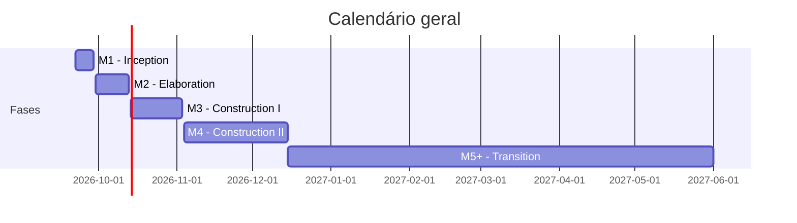

# Calendário Geral do Projeto

!!! note "Estado"
    :white_check_mark: Preenchido com base na apresentação.

Visão de alto nível do calendário do projeto ao longo das cinco milestones apresentadas (M1–M5, correspondentes às fases Inception, Elaboration, Construction e Transition). Para o detalhe de tarefas de cada fase, ver a página "Calendário do projeto" dentro de cada milestone.

