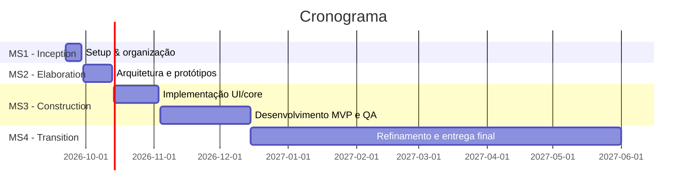

# Calendário do Projeto

## Lista de tarefas

### M1 — Inception (22/09 a 29/09)
- Criação da GitHub Organization — *Bernardo*
- Backlog do projeto em GitHub Projects — *Diogo*
- Logótipo do projeto — *Fernando*
- Estado da Arte — *Guilherme*
- Website do projeto — *Miguel, Fernando*
- APIs e recolha de dados

### M2 — Elaboration (30/09 a 13/10)
- Levantamento de personas, requisitos e user stories
- Desenho de arquitetura
- Diagrama ER e de classes
- Mockups de UI de alta fidelidade
- Configuração do ambiente de desenvolvimento
- Pipeline de CI/CD

### M3 — Construction I (14/10 a 03/11)
- Implementação da UI
- Funcionalidades core
- Testes de usabilidade

### M4 — Construction II (04/11 a 15/12)
- Funcionalidades do MVP:
    - Motor de ingestão de dados unificado
    - Interface COP
    - IA preditiva
    - Sistema de recomendação automática
- Testes de QA
- Estabilização e deployment

### M5 — Transition (15/12/2026 a 01/06/2027)
- Desenvolvimento e refinamento contínuo
- Vídeo comercial
- Poster para o Students@DETI
- Demonstração no Students@DETI
- Relatório final

> **Nota:** a apresentação usa a nomenclatura M1–M5, enquanto este ficheiro (e o `calendario-geral.md`) usava MS1–MS4 (Inception/Elaboration/Construction/Transition). Fiz a correspondência M1→Inception, M2→Elaboration, M3+M4→Construction, M5→Transition, por ser a que faz mais sentido pelo conteúdo das tarefas — mas é uma inferência minha, não algo explícito no PowerPoint. Confirma se está certo ou ajusta.

## Cronograma

<!-- Atenção: o Students@DETI cai dentro do intervalo de M5. -->

## Marcos (Milestones)

| # | Descrição | Data prevista |
|---|---|---|
| M1 | Inception — setup, organização, estado da arte | 22/09/2026 – 29/09/2026 |
| M2 | Elaboration — requisitos, arquitetura, protótipos | 30/09/2026 – 13/10/2026 |
| M3 | Construction I — UI e funcionalidades core | 14/10/2026 – 03/11/2026 |
| M4 | Construction II — MVP, QA, deployment | 04/11/2026 – 15/12/2026 |
| M5,... | Transition — refinamento, divulgação, relatório final | 15/12/2026 – 01/06/2027 |

## Entregáveis

- Motor de ingestão de dados unificado, com conectores nativos para fontes públicas portuguesas (ANEPC, SNS, Fogos.pt)
- Plataforma COP funcional para visualização espácio-temporal de dados, com níveis de acesso público e privado
- Modelo de IA preditiva treinado para previsão de cenários de risco
- Arquitetura escalável, baseada em plugins, preparada para expansão futura da plataforma
- Sistema de recomendação tática para alocação automática de recursos e routing
- Vídeo comercial
- Poster e demonstração para o Students@DETI
- Relatório final