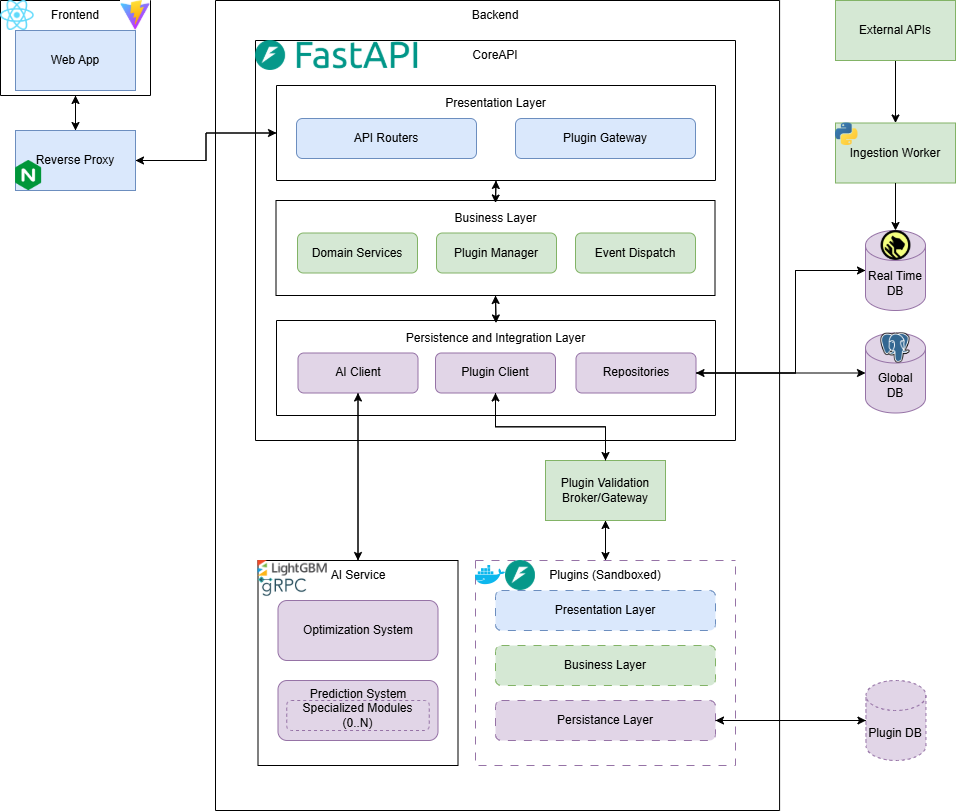

# Architeture

## Diagram

### Color coding

- Blue = User-Facing; shown to the user/client
- Green = Business logic and data flow
- Purple = Integration with everything outside the Core (data and AI)

## Components

### Frontend

- **Web App:** the web application, which is the interface through which the user interacts with the system.
- **Reverse Proxy:** provides intermediary routing, sitting in between the frontend and backend.

### Backend

- **CoreAPI:**

  - **Presentation Layer:**
    - **API Routers:** responsible for routing external API data into the application
    - **Plugin Gateway:** serves as a connection point for the main application to integrate plugins.

  - **Business Layer:**
    - **Domain Services:** contains the core business logic, application rules, and workflows driving the main system.
    - **Plugin Manager:** manages the plugins integrated into the application.
    - **Event Dispatch:** manages the creation and forwarding of events inside the application.

  - **Persistance and Integration Layer:**
    - **AI Client:** handles the predictive features of the application.
    - **Plugin Client:** the internal integration component that interfaces directly with the Plugin Validation Broker/Gateway.
    - **Repositories:** handles the interfacing and between the application backend and the global database.

- **AI Service:**
  - **Optimization System:** handles the optimization of the AI Client, ensuring it performs its predictive work as fast and as efficient as possible.
  - **Prediction System:** the core AI engine that executes model inference and runs zero to multiple dynamically loaded specialized prediction modules.

- **Plugin Validation Broker/Gateway:** a security and validation layer that manages, isolates, and verifies communication between CoreAPI and the sandboxed plugins.

- **Plugins (Sandboxed):**
  - **Presentation Layer:** handles UI components or API entry points specific to the plugin.
  - **Business Layer:** encapsulates the core domain logic and processing specific to the plugin.
  - **Persistance Layer:** manages data access and storage operations between the plugin and the dedicated Plugin DB.

### Data and Data Ingestion

- **External APIs:** APIs external to the application that provide it with real-time data.
- **Ingestion Worker:** consumes the data provided by the external APIs and inserts it into the Real Time DB.
- **Real Time DB:** Stores external API data fed into it by the ingestion worker, making that data available to the application backend and the global DB.
- **Global DB:** the database where data is fetched from and stored long-term.
- **Plugin DB:** handles data produced and required by plugins.

## Tech Stack

