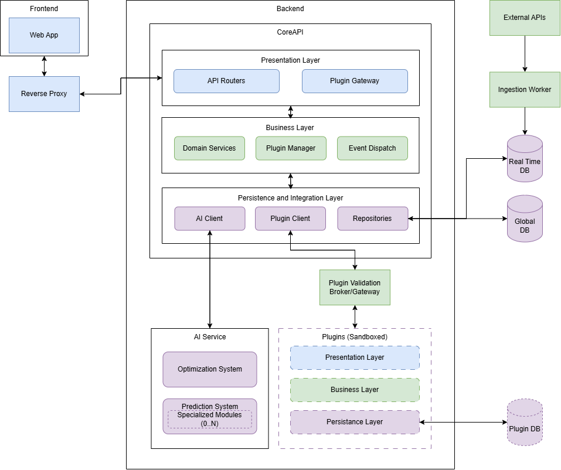

# Architeture

## Diagram

### Color coding

- Blue = User-Facing; shown to the user/client
- Green = Business logic and data flow
- Purple = Integration with everything outside the Core (data and AI)
