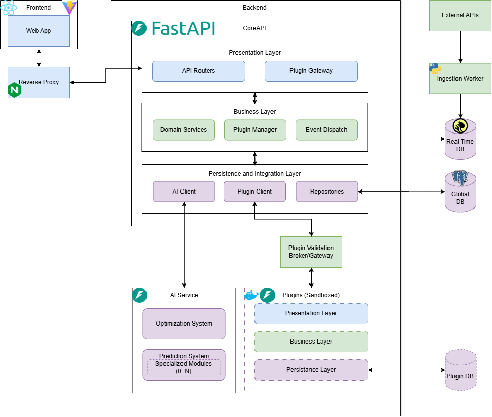

# Architeture

## Diagram

### Color coding

- Blue = User-Facing; shown to the user/client
- Green = Business logic and data flow
- Purple = Integration with everything outside the Core (data and AI)

## Components

### Frontend

- **Web App:** 
- **Reverse Proxy:**

### Backend

- **CoreAPI:**

    - **Presentation Layer:**
        - **API Routers:**
        - **Plugin Gateway:**

    - **Business Layer:**
        - **Domain Services:**
        - **Plugin Manager:**
        - **Event Dispatch:**

    - **Persistance and Integration Layer:**
        - **AI Client:**
        - **Plugin Client:**
        - **Repositories:**

- **AI Service:**
    - **Optimization System:**
    - **Prediction System:**

- **Plugins:**
    - **Presentation Layer:**
    - **Business Layer:**
    - **Persistance Layer:**

### Data and Data Ingestion

- **External APIs:**
- **Ingestion Worker:**
- **Real Time DB:**
- **Global DB:**
- **Plugin DB:**

## Tech Stack
