# Use Cases

This document describes the interactions between the actors and Ad Omnia, organized by package. Each use case (UC) is derived from the [user stories](./user-stories.md) and traced to the [requirements](./requirements.md).

## Actors

| Actor | Type | Application | Description |
| --- | --- | --- | --- |
| Control Room Operator | Primary | Private | Monitors data, manages incidents and resources, publishes to the public (persona: Sofia Marques) |
| Emergency Analyst | Primary | Private | Analyses history, simulates scenarios and exports reports (persona: Tiago Ferreira) |
| Citizen | Primary | Public | Follows active emergencies (persona: Ana Costa) |
| External Data Source | Secondary | - | External API or feed (e.g. Fogos.pt, Flightradar24, SNS, Proteção Civil) that provides data to the system |
| Predictive Engine | Secondary | - | AI Service that produces forecasts, simulations and recommendations |
| Time | Secondary | - | Triggers scheduled behaviour (periodic ingestion, order acknowledgement timeout) |

Out of scope (see [personas](./personas.md)): field responders and system administrators.

## Overview

```mermaid
flowchart LR
    OP([Control Room Operator])
    AN([Emergency Analyst])
    CI([Citizen])
    EXT([External Data Source])
    AI([Predictive Engine])

    subgraph COP[Operational Picture]
        UC01[UC-01 View operational map]
        UC02[UC-02 Filter map]
        UC03[UC-03 View incident / resource details]
    end
    subgraph INC[Incident & Resource Management]
        UC04[UC-04 Create incident]
        UC05[UC-05 Update / close incident]
        UC06[UC-06 Assign / release resources]
        UC07[UC-07 Register order]
        UC08[UC-08 Acknowledge order]
    end
    subgraph ALR[Alerts]
        UC09[UC-09 Receive alert]
        UC10[UC-10 Acknowledge alert]
    end
    subgraph PRD[Prediction & Recommendation]
        UC11[UC-11 View incident forecast]
        UC12[UC-12 View occurrence risk]
        UC13[UC-13 Review recommendations]
        UC14[UC-14 Decide on recommendation]
        UC15[UC-15 Consult decision log]
    end
    subgraph PUB[Public Communication]
        UC16[UC-16 Publish / hide incident]
        UC17[UC-17 Manage area warning]
    end
    subgraph HIS[Historical Analysis]
        UC18[UC-18 Search historical incidents]
        UC19[UC-19 View historical risk map]
    end
    subgraph SIM[Simulation]
        UC20[UC-20 Run simulation]
        UC21[UC-21 Run limit scenario]
        UC22[UC-22 Manage simulations]
    end
    subgraph EXP[Export & Audit]
        UC23[UC-23 Export map / data / report]
        UC24[UC-24 Consult audit trail]
    end
    subgraph PAPP[Public Application]
        UC25[UC-25 View public map]
        UC26[UC-26 View public incident details]
        UC27[UC-27 Filter public incidents]
    end
    subgraph SYS[Platform]
        UC28[UC-28 Authenticate station]
        UC29[UC-29 Ingest external data]
        UC30[UC-30 Monitor connector health]
        UC31[UC-31 Detect incident changes]
    end

    OP --- UC01 & UC02 & UC03 & UC04 & UC05 & UC06 & UC07 & UC08 & UC09 & UC10
    OP --- UC11 & UC12 & UC13 & UC14 & UC15 & UC16 & UC17 & UC23 & UC24 & UC28
    AN --- UC18 & UC19 & UC20 & UC21 & UC22 & UC23 & UC28
    CI --- UC25 & UC26 & UC27
    EXT --- UC29
    AI --- UC11 & UC12 & UC13 & UC20 & UC21
```

> Include/extend relations are listed in each use case below (a diagram per package can be derived from them for the final report).

---

## Package 1: Operational Picture (COP)

### UC-01: View real-time operational map

| | |
| --- | --- |
| **Actor** | Control Room Operator |
| **User story** | US-1 |
| **Requirements** | FR-ING-1, FR-ING-2, FR-COP-1, NFR-PERF-1, NFR-PERF-2, NFR-AVL-1 |
| **Preconditions** | The operator is authenticated (UC-28). |
| **Postconditions** | The map shows the current state of incidents and resources. |

**Main flow**

1. The operator opens the COP.
2. The system displays active incidents, georeferenced and identified by type and severity.
3. The system displays resources with position and status, distinguished by agency and resource type.
4. The system shows, for each data source, the time of its last successful update.
5. While the map is open, the system pushes updates without a manual refresh.

**Alternative flows**

- 4a. A source is unavailable or outdated: the system keeps its last known data visible and flags the source as outdated (within 30 s).
- 5a. The real-time connection is lost: the system warns the operator that the map is not updating.

**Includes:** none. **Extended by:** UC-02, UC-11, UC-12.

### UC-02: Filter map

| | |
| --- | --- |
| **Actor** | Control Room Operator |
| **User story** | US-2 |
| **Requirements** | FR-COP-2, NFR-PERF-2 |
| **Preconditions** | The map is open (UC-01). |
| **Postconditions** | The map shows only the data matching the selected filters. |

**Main flow**

1. The operator toggles layers by agency, resource type, incident type or data source.
2. The operator optionally restricts by geographic area and time window.
3. The system applies the filters (under 1 s) and updates the map.

**Alternative flows**

- 3a. No element matches the filters: the system shows an empty-state message and keeps the filters editable.

### UC-03: View incident or resource details

| | |
| --- | --- |
| **Actor** | Control Room Operator |
| **User story** | US-2 |
| **Requirements** | FR-COP-2, NFR-PERF-2 |
| **Preconditions** | The map is open (UC-01). |
| **Postconditions** | None (read-only). |

**Main flow**

1. The operator selects an incident or resource on the map.
2. The system displays its details (type, status, severity, location, assigned resources/incident, pending orders, timestamps).
3. From the details, the operator can start UC-05, UC-06, UC-07, UC-11, UC-13 or UC-16.

---

## Package 2: Incident and Resource Management

### UC-04: Create incident

| | |
| --- | --- |
| **Actor** | Control Room Operator |
| **User story** | US-3 |
| **Requirements** | FR-INC-1, FR-AUD-1, NFR-USA-1, NFR-INT-1, NFR-AVL-3 |
| **Preconditions** | The operator is authenticated. |
| **Postconditions** | A new incident exists with source "manual"; the creation is audited. |

**Main flow**

1. The operator chooses to create an incident (e.g. reported by phone or radio).
2. The operator enters location, type, severity and description.
3. The system validates the data and creates the incident.
4. The system records author and timestamp (includes UC-24 data) and shows the incident on the map.

**Alternative flows**

- 3a. Mandatory data is missing or invalid: the system highlights the fields and does not create the incident.
- 3b. The location is picked on the map instead of typed.

**Note:** the whole flow must be completable in under 30 s and work offline (NFR-AVL-3).

### UC-05: Update or close incident

| | |
| --- | --- |
| **Actor** | Control Room Operator |
| **User story** | US-3 |
| **Requirements** | FR-INC-1, FR-AUD-1, NFR-INT-1 |
| **Preconditions** | The incident exists and is not closed. |
| **Postconditions** | The incident is updated or closed; the change is audited; a change event is emitted (see UC-09). |

**Main flow**

1. The operator selects an incident (UC-03) and chooses to update it.
2. The operator changes severity and/or status, or chooses to close it.
3. The system saves the change with author and timestamp.
4. If the incident was published, the system updates or removes it from the public application (see UC-16).

**Alternative flows**

- 2a. The operator closes the incident while it still has assigned resources: the system asks whether to release them (UC-06) before closing.
- 3a. The incident was changed by an external source in the meantime: the system warns about the conflict and asks the operator to confirm.

### UC-06: Assign and release resources

| | |
| --- | --- |
| **Actor** | Control Room Operator |
| **User story** | US-3 |
| **Requirements** | FR-INC-2, FR-AUD-1 |
| **Preconditions** | The incident is active; the resource exists. |
| **Postconditions** | The resource is assigned to or released from the incident and its status is updated; the change is audited. |

**Main flow**

1. The operator selects an incident and chooses to assign a resource.
2. The system lists available resources.
3. The operator selects one or more resources.
4. The system assigns them and updates their status.
5. To release, the operator selects an assigned resource and releases it; the system updates its status.

**Alternative flows**

- 3a. The resource is already assigned to another incident: the system warns the operator and asks for confirmation to reassign.
- 4a. The operator only updates a resource status without assigning it (e.g. unavailable, returning).

**Extended by:** UC-14 (accepting a recommendation applies an assignment/release).

### UC-07: Register order

| | |
| --- | --- |
| **Actor** | Control Room Operator |
| **User story** | US-4 |
| **Requirements** | FR-INC-3, FR-AUD-1, NFR-INT-1, NFR-AVL-3 |
| **Preconditions** | The incident and the target resource exist. |
| **Postconditions** | An order exists, linked to the incident and the resource, with automatic timestamp, status "pending". |

**Main flow**

1. The operator chooses to register an order for an incident.
2. The operator selects the resource and enters the order content.
3. The system saves the order with the automatic timestamp.
4. The order appears in the pending orders of the incident.

**Note:** the system only records orders; transmission to the field team happens outside the platform (by radio/phone).

### UC-08: Acknowledge order and track pending orders

| | |
| --- | --- |
| **Actors** | Control Room Operator; Time (timeout) |
| **User story** | US-4 |
| **Requirements** | FR-INC-3, FR-AUD-1, NFR-INT-1 |
| **Preconditions** | A pending order exists. |
| **Postconditions** | The order is marked as acknowledged with the acknowledgement time. |

**Main flow**

1. The operator views the pending orders of an incident.
2. When the field team confirms reception, the operator marks the order as acknowledged.
3. The system records the acknowledgement time.

**Alternative flows**

- 1a. The configurable period elapses without acknowledgement: the system highlights the order as overdue.

---

## Package 3: Alerts

### UC-09: Receive alert

| | |
| --- | --- |
| **Actors** | Control Room Operator; External Data Source |
| **User story** | US-5 |
| **Requirements** | FR-ING-3, FR-ALR-1, NFR-PERF-1 |
| **Preconditions** | The operator is logged in; change detection is running (UC-31). |
| **Postconditions** | An unacknowledged alert is visible to the operator. |

**Main flow**

1. The system detects a new incident from an external source, or a change of severity/status of an existing incident (UC-31).
2. The system generates an alert from the event, within 5 s of data reception.
3. The system shows the alert in the alerts panel and signals it to the operator.

**Includes:** UC-31.

### UC-10: Acknowledge alert

| | |
| --- | --- |
| **Actor** | Control Room Operator |
| **User story** | US-5 |
| **Requirements** | FR-ALR-1, FR-AUD-1 |
| **Preconditions** | An unacknowledged alert exists. |
| **Postconditions** | The alert is acknowledged; it is no longer shown as pending. |

**Main flow**

1. The operator opens the alerts panel.
2. The operator selects an alert (the system centers the map on the related incident).
3. The operator acknowledges it; the system records who and when.

**Alternative flows**

- 3a. The operator does not acknowledge: the alert remains visible.

---

## Package 4: Prediction and Recommendation

### UC-11: View incident progression forecast

| | |
| --- | --- |
| **Actors** | Control Room Operator; Predictive Engine |
| **User story** | US-6 |
| **Requirements** | FR-PRD-1, NFR-AVL-2 |
| **Preconditions** | An active incident is selected. |
| **Postconditions** | None (read-only). |

**Main flow**

1. The operator selects an active incident and chooses to view its forecast, picking a time horizon.
2. The system requests the forecast from the Predictive Engine.
3. The system displays the predicted progression on the map for the chosen horizon.
4. The system shows the confidence level, the generation time and the data the forecast is based on.
5. The system also shows areas with high predicted risk for the coming hours.

**Alternative flows**

- 2a. The Predictive Engine is unavailable: the system shows the failure to the operator; the rest of the platform keeps working (NFR-AVL-2).

### UC-12: View occurrence risk forecast

| | |
| --- | --- |
| **Actors** | Control Room Operator; Predictive Engine |
| **User story** | US-16 |
| **Requirements** | FR-ING-1, FR-PRD-4, NFR-AVL-2 |
| **Preconditions** | Environmental data (wind, humidity, temperature, precipitation) is available. |
| **Postconditions** | None (read-only). |

**Main flow**

1. The operator opens the risk layer.
2. The system displays the risk level per area for the current and following days.
3. The operator selects an area; the system shows the factors contributing most to its risk.
4. The system shows when the risk was last calculated and the date of the forecast data used.

**Alternative flows**

- 2a. Environmental data is outdated or missing: the system flags the affected data and indicates the age of the data used.

### UC-13: Review resource recommendations

| | |
| --- | --- |
| **Actors** | Control Room Operator; Predictive Engine |
| **User story** | US-7 |
| **Requirements** | FR-REC-1, FR-REC-2, NFR-AVL-2 |
| **Preconditions** | An active incident exists. |
| **Postconditions** | Recommendations are stored and displayed; none is applied yet. |

**Main flow**

1. The system generates recommendations to assign or release resources for an incident.
2. The operator opens the recommendations of the incident.
3. For each recommendation, the system shows the suggested resource, a short justification, the route and the estimated arrival time.

**Alternative flows**

- 1a. The recommendation engine is unavailable: the system shows the failure; the operator continues manually (UC-06).
- 3a. No route can be computed: the system shows the recommendation without route and indicates why.

**Extended by:** UC-14.

### UC-14: Accept, adjust or reject recommendation

| | |
| --- | --- |
| **Actor** | Control Room Operator |
| **User stories** | US-7, US-8 |
| **Requirements** | FR-REC-3, FR-INC-2, FR-AUD-1, NFR-INT-1 |
| **Preconditions** | A recommendation is pending (UC-13). |
| **Postconditions** | The decision is stored (who, when, optional reason); the recommendation is applied only if accepted or adjusted. |

**Main flow**

1. The operator selects a recommendation and chooses to accept it.
2. The system applies it (UC-06) and records the decision.

**Alternative flows**

- 1a. Adjust: the operator modifies the recommendation (e.g. a different resource), optionally enters a reason; the system applies the adjusted version and records both the original and the adjusted one.
- 1b. Reject: the operator optionally enters a reason; the system records the rejection and applies nothing.

**Includes:** UC-06 (when applied).

### UC-15: Consult decision log

| | |
| --- | --- |
| **Actor** | Control Room Operator |
| **User story** | US-8 |
| **Requirements** | FR-REC-3, FR-AUD-1, NFR-INT-1 |
| **Preconditions** | The incident has recorded recommendations/decisions. |
| **Postconditions** | None (read-only). |

**Main flow**

1. The operator opens the decision log of an incident.
2. The system lists, in chronological order, every recommendation generated, the decision taken, by whom, when and the reason (if any).

**Extended by:** UC-23 (export of the log).

---

## Package 5: Public Communication (private side)

### UC-16: Publish or hide incident

| | |
| --- | --- |
| **Actor** | Control Room Operator |
| **User story** | US-9 |
| **Requirements** | FR-PUB-1, FR-PUB-6, FR-AUD-1, NFR-SEC-2, NFR-PERF-1 |
| **Preconditions** | The incident exists and is validated by the operator. |
| **Postconditions** | The incident is visible (or no longer visible) in the public application; the action is audited. |

**Main flow**

1. The operator selects a validated incident and chooses to publish it.
2. The system sends the public subset of the incident data to the public application (one-way: private to public).
3. The incident appears on the public map within 5 s.
4. To hide it, the operator chooses to hide; the system removes it from the public application.

**Alternative flows**

- 1a. The incident is not validated: the system refuses to publish it.
- 2a. The private-to-public link is unavailable: the system informs the operator and keeps the request pending; the public app keeps showing the last published state (NFR-AVL-4).

**Note:** closing a published incident (UC-05) removes it automatically from the public application.

### UC-17: Issue, update or end area warning

| | |
| --- | --- |
| **Actor** | Control Room Operator |
| **User story** | US-9 |
| **Requirements** | FR-PUB-1, FR-PUB-8, FR-AUD-1, NFR-SEC-2 |
| **Preconditions** | The operator is authenticated. |
| **Postconditions** | A warning is active, updated or ended in the public application; the action is audited. |

**Main flow**

1. The operator chooses to issue a warning and draws or selects a geographic area.
2. The operator enters a message and a severity level.
3. The system publishes the warning to the public application.
4. Later, the operator updates the message/severity or ends the warning; the system reflects the change in the public application.

---

## Package 6: Historical Analysis

### UC-18: Search historical incidents

| | |
| --- | --- |
| **Actor** | Emergency Analyst |
| **User story** | US-10 |
| **Requirements** | FR-HIST-1, FR-HIST-3 |
| **Preconditions** | The analyst is authenticated. |
| **Postconditions** | None (read-only). |

**Main flow**

1. The analyst opens the historical search.
2. The analyst applies any combination of zone, date/time range and incident type.
3. The system returns the matching incidents within a reasonable time.
4. For each result, the system shows its own data (location, type, status, timestamps) and the directly related information: linked entities (resources, orders, alerts, logs) and related incidents, each labeled with its relationship (e.g. "referenced by", "caused by", "merged into").

**Alternative flows**

- 3a. No incident matches: the system shows an explicit "no results" state.

**Extended by:** UC-23. **Note:** internal-only fields are never exposed outside the private application.

### UC-19: View historical risk map

| | |
| --- | --- |
| **Actor** | Emergency Analyst |
| **User story** | US-11 |
| **Requirements** | FR-HIST-2 |
| **Preconditions** | Historical data is available. |
| **Postconditions** | None (read-only). |

**Main flow**

1. The analyst opens the historical risk map.
2. The system displays zones ranked or color-coded by historical risk (frequency, severity, type).
3. The analyst filters by time period (e.g. a season or month range); the map updates.
4. The analyst selects a zone; the system shows incident count, types and trend over time.
5. The system shows the date range of the underlying data and when the calculation was last refreshed.

**Extended by:** UC-23.

---

## Package 7: Simulation

### UC-20: Configure and run simulation

| | |
| --- | --- |
| **Actors** | Emergency Analyst; Predictive Engine |
| **User story** | US-12 |
| **Requirements** | FR-PRD-2, NFR-AVL-2 |
| **Preconditions** | The analyst is authenticated. |
| **Postconditions** | A projected outcome exists, marked as synthetic; live data is unchanged. |

**Main flow**

1. The analyst creates a simulation and sets time window, zone(s), expected event type and synthetic/historical data inputs.
2. The system sends the configuration to the Predictive Engine.
3. The system displays the projected outcome (incident volume, severity distribution, resource demand), visually and explicitly marked as synthetic/predictive.

**Alternative flows**

- 1a. Invalid parameters (e.g. empty zone or inverted time window): the system points out the problem and does not run.
- 2a. The Predictive Engine fails: the system shows the failure; the rest of the platform is unaffected.

**Extended by:** UC-21, UC-22, UC-23.

### UC-21: Run limit-scenario simulation

| | |
| --- | --- |
| **Actors** | Emergency Analyst; Predictive Engine |
| **User story** | US-13 |
| **Requirements** | FR-PRD-3, NFR-AVL-2 |
| **Preconditions** | Available resources are registered in the system. |
| **Postconditions** | Saturation results exist, marked as synthetic; live data is unchanged. |

**Main flow**

1. The analyst defines a scenario in which simulated demand is scaled up until all available resources are saturated.
2. The system runs the simulation through the Predictive Engine.
3. The system reports the saturation point, which resource types run out first, and the gaps between demand and capacity (unmet requests, response delays).

### UC-22: Save, re-run and compare simulations

| | |
| --- | --- |
| **Actor** | Emergency Analyst |
| **User story** | US-12 (optional criterion) |
| **Requirements** | FR-PRD-5 |
| **Preconditions** | At least one simulation has been run (UC-20 or UC-21). |
| **Postconditions** | Simulations are stored and can be compared. |

**Main flow**

1. The analyst saves a simulation.
2. The analyst re-runs a saved simulation with adjusted parameters (a new result is stored, the original is kept).
3. The analyst selects two or more simulations; the system shows them side by side.

---

## Package 8: Export and Audit

### UC-23: Export map, data or report

| | |
| --- | --- |
| **Actors** | Emergency Analyst; Control Room Operator (for the decision log) |
| **User stories** | US-14, US-8 |
| **Requirements** | FR-EXP-1, FR-AUD-2, FR-AUD-1 |
| **Preconditions** | There is content to export (map view, historical results, risk analysis, simulation, decision log). |
| **Postconditions** | A file is generated with metadata; the export is logged. |

**Main flow**

1. The user chooses to export from the current view.
2. The user selects what to export (map view with active filters/layers, or underlying data) and the format (image/document, or CSV/PDF).
3. The system generates the file including generation date/time, applied filters and data source/time range.
4. The system logs who exported what and when.

**Extends:** UC-02, UC-15, UC-18, UC-19, UC-20, UC-21.

### UC-24: Consult audit trail

| | |
| --- | --- |
| **Actor** | Control Room Operator |
| **User story** | US-3, US-8 (audit criterion) |
| **Requirements** | FR-AUD-1, FR-AUD-2, NFR-INT-1 |
| **Preconditions** | The incident has recorded changes. |
| **Postconditions** | None (read-only). |

**Main flow**

1. The operator opens the audit trail of an incident.
2. The system lists every change to the incident, its resources, orders, recommendations and public warnings, with author and timestamp.
3. The operator optionally exports the trail (UC-23).

**Note:** audit records cannot be edited or deleted; tampering must be detectable (NFR-INT-1).

---

## Package 9: Public Application

### UC-25: View public emergency map

| | |
| --- | --- |
| **Actor** | Citizen |
| **User story** | US-15 |
| **Requirements** | FR-PUB-2, FR-PUB-5, FR-PUB-7, NFR-AVL-4, NFR-SEC-3, NFR-SCA-1, NFR-USA-2 |
| **Preconditions** | None (no installation or login). |
| **Postconditions** | None (no personal data is collected). |

**Main flow**

1. The citizen opens the public application in a browser (including on a smartphone).
2. The system displays a map with all active incidents validated by an operator, with a distinct icon per type and a legend.
3. The system shows the time of the last update of the public data.
4. The system also shows the active area warnings.

**Alternative flows**

- 3a. The data is outdated or the source is unreachable: the system shows a clear warning and keeps serving the last published state.
- 2a. There are no active incidents: the system shows an explicit "no active incidents" message.

**Extended by:** UC-26, UC-27.

### UC-26: View public incident details

| | |
| --- | --- |
| **Actor** | Citizen |
| **User story** | US-15 |
| **Requirements** | FR-PUB-3, FR-PUB-7, NFR-SEC-3 |
| **Preconditions** | The public map is open. |
| **Postconditions** | None. |

**Main flow**

1. The citizen selects an incident on the map.
2. The system shows its type, approximate location, current status and time of last update; no operational data is exposed.

### UC-27: Filter public incidents by type

| | |
| --- | --- |
| **Actor** | Citizen |
| **User story** | US-15 |
| **Requirements** | FR-PUB-4 |
| **Preconditions** | The public map is open. |
| **Postconditions** | None. |

**Main flow**

1. The citizen selects one or more incident types.
2. The system shows only incidents of those types.

**Alternative flows**

- 2a. No incident of the selected types is active: the system shows an explicit empty message.

---

## Package 10: Platform (system-level)

### UC-28: Authenticate control room station

| | |
| --- | --- |
| **Actors** | Control Room Operator; Emergency Analyst |
| **User story** | Applies to all private-application stories |
| **Requirements** | NFR-SEC-1, NFR-SEC-4 |
| **Preconditions** | The station has a license. |
| **Postconditions** | Access is granted or denied; the attempt is logged. |

**Main flow**

1. The user opens the private application.
2. The station presents its license.
3. The system validates it against the stored hash and grants access.

**Alternative flows**

- 3a. The license is invalid: the system denies access and logs the attempt.

**Included by:** all private-application use cases.

### UC-29: Ingest external data

| | |
| --- | --- |
| **Actors** | External Data Source; Time |
| **User story** | US-1 (supporting) |
| **Requirements** | FR-ING-1, NFR-PERF-1, NFR-AVL-1 |
| **Preconditions** | A connector (plugin) is configured for the source. |
| **Postconditions** | Normalized data is stored in the common data model. |

**Main flow**

1. At the configured frequency (or when a feed pushes data), the connector fetches data from the source.
2. The connector converts it to the common internal data model.
3. The system stores the data and makes it available to the COP (within 5 s).
4. The system registers the time of the last successful update (UC-30).

**Alternative flows**

- 1a. The source does not respond or returns invalid data: the system keeps the last known data, flags the source as outdated and keeps the other connectors running.

**Includes:** UC-30, UC-31.

### UC-30: Monitor connector health

| | |
| --- | --- |
| **Actors** | Time |
| **User story** | US-1, US-15 (supporting) |
| **Requirements** | FR-ING-2, NFR-AVL-1 |
| **Preconditions** | At least one connector is configured. |
| **Postconditions** | Each connector has a status and a last-successful-update time. |

**Main flow**

1. After each ingestion attempt, the system updates the connector status and last successful update.
2. If no successful update occurs within the expected period, the system marks the source as outdated (within 30 s) and exposes this to the COP (UC-01) and the public application (UC-25).

### UC-31: Detect incident changes

| | |
| --- | --- |
| **Actor** | Time |
| **User story** | US-5 (supporting) |
| **Requirements** | FR-ING-3, NFR-PERF-1 |
| **Preconditions** | Ingested incidents exist. |
| **Postconditions** | A change event is emitted for each new incident or relevant change. |

**Main flow**

1. After ingestion, the system compares the received incidents with the stored ones.
2. For each new incident, or change in severity/status, the system emits an event.
3. The event is consumed by the alert generation (UC-09) and the map update (UC-01).

---

## Traceability: user stories to use cases

| User story | Use cases |
| --- | --- |
| US-1: Real-time operational map | UC-01, UC-29, UC-30 |
| US-2: Map filtering and details | UC-02, UC-03 |
| US-3: Incident and resource management | UC-04, UC-05, UC-06, UC-24 |
| US-4: Order tracking | UC-07, UC-08 |
| US-5: Incident alerts | UC-09, UC-10, UC-31 |
| US-6: Risk forecasting | UC-11 |
| US-7: Tactical recommendations | UC-13, UC-14 |
| US-8: Decision log | UC-14, UC-15, UC-23 |
| US-9: Public communication | UC-16, UC-17 |
| US-10: Historical incident search | UC-18 |
| US-11: Historical risk map | UC-19 |
| US-12: Pre-event simulation | UC-20, UC-22 |
| US-13: Limit-scenario simulation | UC-21 |
| US-14: Export for planning | UC-23 |
| US-15: Public emergency map | UC-25, UC-26, UC-27, UC-30 |
| US-16: Occurrence risk forecasting | UC-12 |
| NFR-SEC-1 / NFR-SEC-4 (all private stories) | UC-28 |

## Assumptions and dependencies

- The private application runs on-premises in the control room; the public application receives data only through the one-way private-to-public link.
- Orders are recorded in the platform but transmitted to field teams outside it.
- External sources (e.g. Fogos.pt, Flightradar24, SNS, Proteção Civil) may be unavailable or change format; connectors are isolated plugins (see the architecture).
- The Predictive Engine may be unavailable without affecting the remaining use cases (NFR-AVL-2).
- Users of the private application are authenticated by station license (UC-28); the public application has no authentication.
