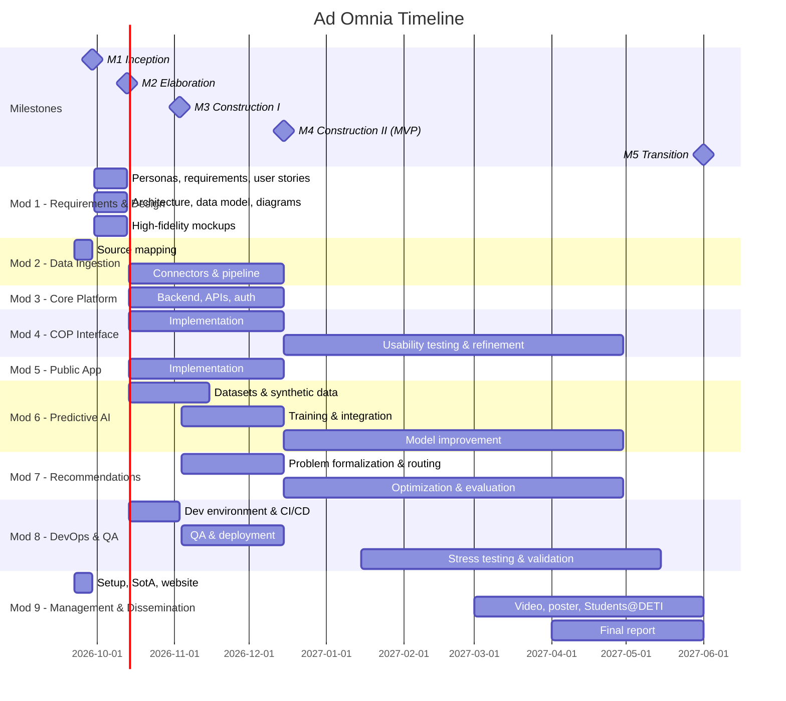

# Ad-Omnia Workplan

## Scope

Ad Omnia is a command-and-control platform for crisis and emergency management, initially focused on the Portuguese civil sector. It aggregates heterogeneous public data sources and real-time feeds into a unified Common Operational Picture (COP), supported by predictive AI and automatic resource allocation recommendations.

The platform is composed of two applications:

- **Private application (control room)** — used by emergency and security agencies. Runs locally in the control room to reduce exposure to tracking and external attack surfaces. Provides the full COP, predictive scenarios and tactical recommendations. Contains the core layer of the architecture as well as plugins built with advanced particularities and deeper operational control.
- **Public application (citizens)** — shows active emergencies and essential information during a crisis, and allows citizens to follow incidents. Contains the core layer of the architecture.

## Objectives

- Integrate diverse data into a single platform​
- Build a COP (Common Operational Picture) interface for decision support​
- Develop a predictive AI engine to anticipate risk scenarios​
- Automated recommendation for resource allocation, routing, etc.​

## Methodology

The team follows an Agile methodology based on Scrum, adapted to the academic calendar and the course milestones.

- **Sprints**: 2 weeks, aligned with milestone boundaries whenever possible. Each milestone (M2–M4) is composed of one or more sprints.
- **Ceremonies**:
  - **Sprint Planning**: at the start of each sprint, select and estimate backlog items
  - **Sprint Review**: demo of the sprint increment to the advisors
  - **Sprint Retrospective**: what went well, what to improve
- **Backlog management**: GitHub Projects
- **Version control**: GitHub organization (Ad-Omnia), feature branches, Pull Requests with at least one reviewer before merging into main.
- **Definition of Done**: code reviewed and merged, tests passing in CI, documentation updated in the project website, feature demonstrable.
- **Communication**: Discord (team), WhatsApp (team, advisors), GitHub Projects (backlog), project website (documentation and public reports).

## Modules

### Module 1: Requirements & Design

Initial requirements elicitation and system design, shared by all other modules. Corresponds to the Elaboration milestone (M2). After M2, user stories keep being refined within each module during the sprints.

**Tasks**:

- Personas for control room operators and citizens
- Functional and non-functional requirements
- User stories for both applications
- Architecture design (microservices, communication between services, plugin system)
- Common (harmonized) data model for incidents, resources, locations and events
- ER and class diagrams
- High-fidelity UI mockups for the COP and the public application
- Decide whether the private application consumes external feeds directly or through an intermediate component

### Module 2: Data Ingestion & Harmonization

Responsible for collecting, normalizing and storing data from all external sources into a common data model.

**Tasks**:

- Map available data sources, formats, update frequencies and access conditions
- Implement connectors for each source as independent plugins
- Real-time ingestion pipeline
- Storage of historical data for AI training
- Data quality checks (missing values, duplicates, outdated records)

### Module 3: Core Platform & Architecture

Backend services, APIs and the plugin architecture that connect all other modules.

**Tasks**:

- API gateway and internal APIs
- Authentication, authorization and access levels
- Separation between the private and public deployments
- Plugin interface for new data sources and modules (dual-use extensibility)

### Module 4: COP Interface (Private Application)

The main control room console.

**Tasks**:

- Interactive map with layers (incidents, resources, aircraft, infrastructure)
- Temporal navigation (timeline / replay of events)
- Visualization of predicted scenarios and recommendations
- Alerts and notifications
- Usability testing with representative users

### Module 5: Public Application (Citizens)

**Tasks**:

- Map and list of active emergencies
- Usability testing

**Further improvements**:

- Incident reporting (location, description, photos)
- Validation/moderation flow for citizen reports before they reach the COP

### Module 6: Predictive AI & Synthetic Data Engine

**Tasks**:

- Survey of predictive approaches for incident progression (e.g., fire spread)
- Dataset preparation from historical records
- Synthetic data generation module for extreme / rare events
- Model training and evaluation against baselines
- Model serving (inference API) and integration with the COP
- Model monitoring and retraining strategy

### Module 7: Tactical Recommendation Engine

**Tasks**:

- Formalize the resource allocation and routing problem (constraints, objectives)
- Routing over the road network (cartography)
- Allocation algorithms (heuristics / optimization)
- Integrate predictions from Module 6 into recommendations
- Present recommendations in the COP with explanation of the reasoning
- Evaluate recommendations in simulated scenarios

### Module 8: DevOps, Security & Quality Assurance

**Tasks**:

- Development environment setup (containers, shared configuration)
- CI/CD pipeline (build, tests, linting, deployment)
- Deployment of the public application and of a local control room setup
- Security hardening of the private application (network isolation, access control, secrets management)
- Automated testing (unit, integration, end-to-end)
- Stress and load testing (ingestion throughput, COP latency)
- Validation in simulated crisis scenarios

### Module 9: Project Management & Dissemination

**Tasks**:

- GitHub organization and backlog in GitHub Projects
- State of the Art
- Project logo and website (documentation)
- Commercial video
- Poster and demonstration for Students@DETI
- Participation in events and meetings with emergency/security agencies
- Final report

## Calendar

| # | Milestone | Dates | Main tasks | Modules |
| --- | --- | --- | --- | --- |
| M1 | **Inception** — setup, organization, state of the art | 22/09/2026 – 29/09/2026 | GitHub organization, backlog, logo, state of the art, website, APIs and data collection | Mod 2, Mod 9 |
| M2 | **Elaboration** — requirements, architecture, prototypes | 30/09/2026 – 13/10/2026 | Personas, requirements and user stories, architecture design, ER and class diagrams, high-fidelity mockups, common data model | Mod 1 |
| M3 | **Construction I** — UI and core features | 14/10/2026 – 03/11/2026 | UI implementation, core features, first connectors, dev environment, CI/CD, usability testing, dataset preparation | Mod 2, Mod 3, Mod 4, Mod 5, Mod 6, Mod 8 |
| M4 | **Construction II** — MVP, QA, deployment | 04/11/2026 – 15/12/2026 | MVP: unified ingestion engine, COP interface, predictive AI, recommendation system; QA testing, stabilization and deployment | Mod 2 – Mod 8 |
| M5 | **Transition** — refinement, dissemination, final report | 15/12/2026 – 01/06/2027 | Continuous development and refinement, stress testing and validation, commercial video, poster and demo at Students@DETI, final report | Mod 4 – Mod 9 |

## Team roles

| Name | Role | Contact |
| --- | --- | --- |
| Bernardo Reis | ML Engineer | <bernardo.reis@ua.pt> |
| Diogo Silva | SCRUM Master | <diogo.c.silva@ua.pt> |
| Fernando Santos | Architect | <frsantos@ua.pt> |
| Guilherme Martins | DevOps | <guilherme.m.martins@ua.pt> |
| Miguel Neto | Backend | <miguelsneto@ua.pt> |

## Risks and mitigation

| Risk | Probability | Impact | Mitigation |
| --- | --- | --- | --- |
| Public data sources become unavailable, change format or have insufficient granularity | Medium | High | Decouple connectors as plugins; cache and store historical snapshots; define fallback sources; mock data for development |
| Third-party APIs have usage restrictions, costs or rate limits | High | Medium | Evaluate open alternatives, respect rate limits with caching |
| Insufficient or unlabelled historical data to train the predictive model | High | High | Synthetic data generation module |
| Real-time performance of the COP degrades with many entities | Medium | High | Define latency targets early; load testing from M4; aggregation/clustering on the map; efficient streaming |
| Scope too large for the available time | High | High | Prioritize the MVP in the backlog; deliver the minimum version of each module first and iterate; review scope at each Sprint Review |
| Security vulnerabilities | Medium | High | Local deployment and network isolation for the private application; authentication and access control; dependency scanning in CI; security review before deployment; safe-by-design API |
| False or malicious citizen reports in the public app | High | Medium | Moderation/validation before reports reach the COP; rate limiting; reports clearly marked as unverified |
| Personal data in citizen reports (GDPR) | Medium | Medium | Collect the minimum necessary data; anonymization; clear privacy notice |
| No access to real operators for validation | Medium | Medium | Contact agencies early through the advisors; validate with simulated scenarios and proxy users |
| Team availability (other courses, exams) | High | Medium | Plan sprints around evaluation periods; shared knowledge through code reviews and documentation; secondary roles as backup |

## External dependencies

- Public data and endpoints
- Third-party APIs
- Operational validation: access to professionals from emergency and security agencies to validate requirements, usability and the usefulness of recommendations, facilitated by the advisors.
- Advisors and course calendar: feedback at Sprint Reviews and milestone deadlines defined by the course.

## Criteria to success

The project will be considered successful if, by the end of M5:

- **Data ingestion:** at least the core sources are integrated through plugin connectors into the common data model, with real-time sources updating automatically.
- **COP:** the private application displays incidents, resources and real-time data on a map with temporal navigation.
- **Public application:** citizens can view active emergencies.
- **Predictive AI:** the model outperforms a defined baseline on agreed metrics and its predictions are visible in the COP.
- **Recommendations:** the system produces resource allocation and routing suggestions for simulated scenarios within a few seconds, and they are judged reasonable by the advisors and, if possible, by agency professionals.
- **Architecture:** a new data source or module can be added as a plugin without changes to the core platform.
- **Quality:** CI/CD pipeline running, automated tests for the core services, stress tests executed and results documented.
- **Usability:** usability tests performed with representative users.
- **Deliverables:** all milestones and deliverables delivered on time.
